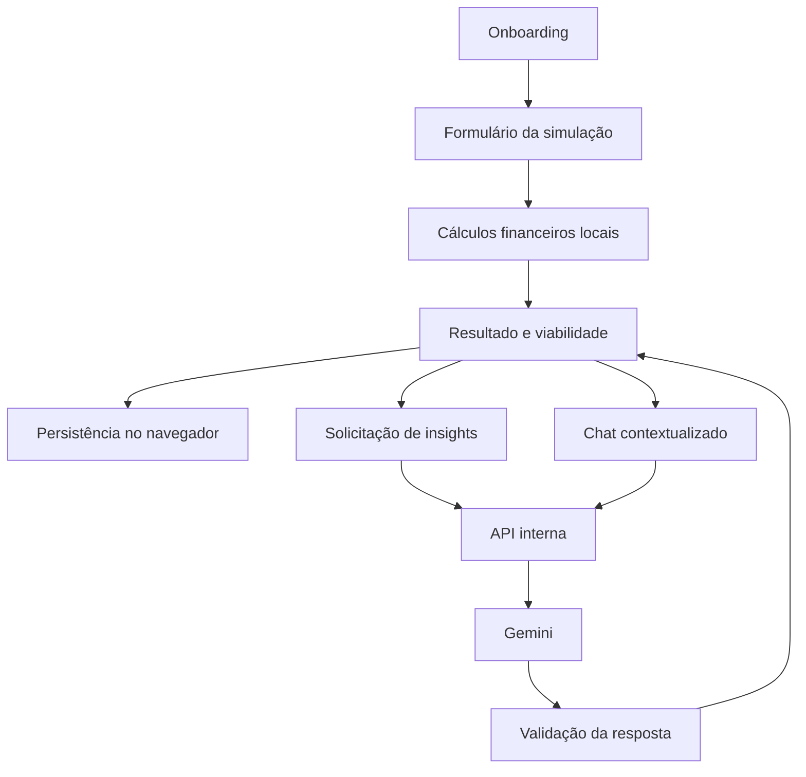

<div align="center">


# Grana Clara

### Educação financeira simples, prática e inteligente com apoio de IA

Aplicação web **mobile-first** para simular metas financeiras, avaliar viabilidade, consultar histórico e conversar com um educador financeiro contextualizado por inteligência artificial.

<br />

[](https://react.dev/)
[](https://www.typescriptlang.org/)
[](https://vite.dev/)
[](https://tailwindcss.com/)
[](https://vitest.dev/)
[](https://ai.google.dev/)
[](#roadmap)

</div>

---

## Visão geral

O **Grana Clara** foi desenvolvido para transformar informações financeiras em uma experiência mais compreensível e orientada à ação.

A pessoa usuária informa sua realidade financeira, define uma meta e recebe:

- cálculo de disponibilidade mensal;
- estimativa de economia necessária;
- análise de viabilidade da meta;
- recomendações educativas geradas por IA;
- histórico local das simulações;
- chat contextualizado com base na simulação escolhida.

A inteligência artificial não substitui os cálculos da aplicação. Os resultados financeiros são calculados localmente, enquanto o Gemini é utilizado para transformar esses dados em explicações claras, educativas e personalizadas.

> **Aviso:** o Grana Clara possui finalidade educacional. Ele não oferece consultoria financeira, recomendação de investimentos ou promessa de resultados.

---

## Social preview

<p align="center">
  
</p>

---

## Principais funcionalidades

### Onboarding financeiro

Fluxo inicial com perguntas sobre:

- situação financeira atual;
- fonte de renda;
- controle de gastos;
- objetivo principal;
- prazo pretendido;
- nível de conhecimento financeiro;
- tempo disponível para organização.

As respostas ajudam a personalizar os insights e o chat financeiro.

### Simulação de metas

A aplicação coleta:

- renda mensal bruta;
- custos fixos essenciais;
- dívidas parceladas mensais;
- meta financeira;
- custo total da meta;
- prazo desejado em meses.

Com esses dados, calcula:

```text
Valor disponível por mês
= renda mensal bruta
- custos fixos essenciais
- dívidas parceladas mensais
```

```text
Economia mensal necessária
= custo total da meta
÷ prazo desejado em meses
```

```text
Saldo após reserva para a meta
= valor disponível por mês
- economia mensal necessária
```

### Diagnóstico de viabilidade

A simulação é classificada em um dos seguintes estados:

- **Meta viável**
- **Meta que precisa de ajustes**
- **Meta inviável nas condições atuais**

### Insights com inteligência artificial

O backend envia ao Gemini apenas os dados estruturados necessários para produzir uma análise educativa.

Os insights são:

- validados por schema;
- vinculados à versão do prompt;
- apresentados separadamente dos cálculos;
- protegidos contra respostas vazias ou fora do formato esperado.

### Chat financeiro contextualizado

O Educador Financeiro recebe:

- dados da simulação;
- resultado calculado;
- perfil do onboarding;
- histórico recente da conversa;
- versão do prompt.

O chat utiliza linguagem simples, educativa e responsável. A aplicação limita o tamanho das mensagens e a quantidade de itens enviados no histórico.

### Histórico local

As simulações e conversas ficam armazenadas no navegador.

É possível:

- consultar simulações anteriores;
- abrir novamente o resultado;
- continuar uma conversa;
- excluir uma simulação;
- limpar todo o histórico.

### Tema claro e escuro

A interface oferece:

- alternância manual de tema;
- persistência da preferência;
- leitura da preferência do sistema;
- design tokens em CSS;
- transições respeitando `prefers-reduced-motion`.

### Acessibilidade

O projeto inclui:

- link “Pular para o conteúdo principal”;
- hierarquia de títulos;
- foco visível;
- foco programático após navegação;
- anúncios por regiões `aria-live`;
- estados de carregamento acessíveis;
- labels e descrições de formulário;
- navegação completa por teclado;
- suporte a leitores de tela;
- respeito à preferência de redução de movimento;
- página 404 acessível.

---

## Stack

### Frontend

| Tecnologia | Uso |
|---|---|
| React 19 | Interface e composição de componentes |
| TypeScript | Tipagem estática |
| React Router 8 | Rotas, parâmetros e carregamento assíncrono |
| Vite 8 | Desenvolvimento, build e preview |
| Tailwind CSS 4 | Estilização utilitária |
| React Markdown | Renderização das respostas do chat |
| Zod | Validação de dados e respostas |
| clsx | Composição condicional de classes |

### Backend

| Tecnologia | Uso |
|---|---|
| Node.js | Servidor HTTP |
| TypeScript | Tipagem do backend |
| `node:http` | API interna sem framework |
| Google GenAI SDK | Integração com Gemini |
| dotenv | Variáveis de ambiente |
| Zod | Validação das requisições |
| tsx | Execução e modo watch |

### Qualidade

| Tecnologia | Uso |
|---|---|
| Vitest | Testes automatizados |
| Testing Library | Testes de componentes e páginas |
| jest-dom | Matchers de DOM e acessibilidade |
| jsdom | Ambiente de navegador para testes |
| ESLint | Análise estática |
| TypeScript compiler | Verificação de tipos e build |

---

## Arquitetura

O projeto separa interface, regras financeiras, persistência, integração HTTP e serviços de IA.

```text
grana-clara/
├── public/
│   ├── apple-touch-icon.png
│   ├── favicon.svg
│   ├── icon-192.png
│   ├── icon-512.png
│   ├── logo-grana-clara-horizontal.png
│   ├── manifest.webmanifest
│   ├── og-grana-clara.png
│   ├── robots.txt
│   └── social-preview.png
├── server/
│   ├── prompts/
│   │   ├── buildFinancialInsightsPrompt.ts
│   │   └── financialChatSystemInstruction.ts
│   ├── schemas/
│   │   ├── financialChatRequestSchema.ts
│   │   └── financialInsightsRequestSchema.ts
│   ├── services/
│   │   ├── geminiChatService.ts
│   │   └── geminiInsightsService.ts
│   └── index.ts
├── src/
│   ├── components/
│   │   ├── brand/
│   │   ├── common/
│   │   ├── finance/
│   │   ├── form/
│   │   └── onboarding/
│   ├── constants/
│   ├── layouts/
│   ├── pages/
│   ├── routes/
│   ├── schemas/
│   ├── services/
│   ├── styles/
│   ├── test/
│   ├── types/
│   ├── utils/
│   └── main.tsx
├── .env.example
├── index.html
├── package.json
├── tsconfig.json
├── vite.config.ts
└── README.md
```

### Fluxo principal



### Separação de responsabilidades

```text
Frontend
  ├─ coleta e valida dados
  ├─ executa cálculos financeiros
  ├─ gerencia rotas e acessibilidade
  ├─ persiste simulações e conversas
  └─ consome somente endpoints internos /api

Backend
  ├─ protege a chave Gemini
  ├─ valida requisições
  ├─ monta prompts estruturados
  ├─ aplica limites e timeouts
  ├─ trata erros do provedor
  └─ valida respostas antes de enviá-las ao navegador
```

---

## Segurança da integração com IA

A chave Gemini permanece exclusivamente no backend.

```text
Navegador
   │
   ├── POST /api/ai/insights
   └── POST /api/ai/chat
            │
            ▼
       API interna
            │
            ▼
          Gemini
```

Medidas implementadas:

- `.env` ignorado pelo Git;
- nenhuma variável secreta utiliza prefixo `VITE_`;
- chave ausente do bundle do navegador;
- validação de `Content-Type`;
- limite configurável para o corpo das requisições;
- rate limit em memória por endereço IP;
- validação de payloads com Zod;
- respostas HTTP padronizadas;
- cabeçalhos defensivos;
- `Cache-Control: no-store`;
- `X-Content-Type-Options: nosniff`;
- `Content-Security-Policy` para as respostas da API;
- timeouts de requisição e cabeçalhos;
- tratamento de requisições malformadas;
- logs controlados sem chave ou corpo completo;
- encerramento por `SIGINT` e `SIGTERM`;
- repetição com backoff para falhas temporárias do chat.

> Em um ambiente distribuído, o rate limit em memória deve ser complementado por regras no gateway, proxy reverso ou provedor de hospedagem.

---

## Endpoints

### Verificação de saúde

```http
GET /api/health
```

Resposta:

```json
{
  "status": "ok",
  "service": "grana-clara-api"
}
```

### Insights financeiros

```http
POST /api/ai/insights
Content-Type: application/json
```

Envia a simulação, o resultado calculado, as respostas do onboarding e a versão do prompt.

### Chat financeiro

```http
POST /api/ai/chat
Content-Type: application/json
```

Envia o contexto financeiro, a pergunta atual e as mensagens recentes da conversa.

---

## Pré-requisitos

- Node.js 24 ou versão compatível com o projeto
- npm 11
- chave válida da API Gemini

Versões utilizadas durante o desenvolvimento:

```text
Node.js 24.16.0
npm 11.7.0
```

---

## Instalação

### 1. Clone o repositório

```bash
git clone https://github.com/omarkfrank/Grana-Clara.git
cd Grana-Clara
```

### 2. Instale as dependências

```bash
npm install
```

### 3. Crie o arquivo de ambiente

No Windows PowerShell:

```powershell
Copy-Item ".env.example" ".env"
```

No Linux ou macOS:

```bash
cp .env.example .env
```

### 4. Configure a chave do Gemini

Edite `.env`:

```env
GEMINI_API_KEY=sua_chave_privada
GEMINI_MODEL=gemini-3.6-flash
```

Nunca envie o arquivo `.env` ao GitHub.

### 5. Inicie frontend e backend

```bash
npm run dev
```

Serviços padrão:

```text
Frontend: http://localhost:5173
API:      http://127.0.0.1:8787
```

---

## Variáveis de ambiente

| Variável | Obrigatória | Valor padrão | Descrição |
|---|---:|---|---|
| `GEMINI_API_KEY` | Sim | — | Chave privada usada exclusivamente pelo backend |
| `GEMINI_MODEL` | Não | `gemini-3.6-flash` | Modelo utilizado em insights e chat |
| `AI_API_HOST` | Não | `127.0.0.1` | Endereço em que a API escuta conexões |
| `AI_API_PORT` | Não | `8787` | Porta da API |
| `AI_MAX_BODY_SIZE_BYTES` | Não | `65536` | Limite máximo do corpo HTTP |
| `AI_RATE_LIMIT_WINDOW_MS` | Não | `60000` | Janela do rate limit |
| `AI_RATE_LIMIT_MAX_REQUESTS` | Não | `20` | Requisições permitidas por IP na janela |
| `API_PROXY_TARGET` | Não | `http://127.0.0.1:8787` | Destino do proxy do Vite |

Exemplo completo:

```env
GEMINI_API_KEY=
GEMINI_MODEL=gemini-3.6-flash

AI_API_HOST=127.0.0.1
AI_API_PORT=8787
AI_MAX_BODY_SIZE_BYTES=65536

AI_RATE_LIMIT_WINDOW_MS=60000
AI_RATE_LIMIT_MAX_REQUESTS=20

API_PROXY_TARGET=http://127.0.0.1:8787
```

---

## Scripts

| Comando | Descrição |
|---|---|
| `npm run dev` | Inicia frontend e API em modo desenvolvimento |
| `npm run dev:web` | Inicia somente o Vite |
| `npm run dev:api` | Inicia a API em modo watch |
| `npm run start:api` | Inicia a API sem watch |
| `npm run lint` | Executa o ESLint |
| `npm run test` | Executa todos os testes uma vez |
| `npm run test:watch` | Executa o Vitest em modo observação |
| `npm run build` | Verifica tipos e gera o bundle de produção |
| `npm run check` | Executa lint, testes e build |
| `npm run preview` | Serve o bundle de produção |
| `npm run preview:full` | Inicia preview do frontend e API |

---

## Testes e validação

O projeto possui testes de:

- cálculos financeiros;
- formulários;
- onboarding;
- componentes comuns;
- alternância de tema;
- insights da IA;
- persistência de conversas;
- páginas;
- gerenciamento de histórico;
- chat contextual;
- acessibilidade;
- rotas e página 404.

Checkpoint validado:

```text
18 arquivos de teste aprovados
123 testes aprovados
ESLint aprovado
TypeScript aprovado
Build de produção aprovado
```

Validação completa:

```bash
npm run check
```

---

## Rotas

| Caminho | Página |
|---|---|
| `/` | Página inicial |
| `/simulacao` | Nova simulação |
| `/resultado/:simulationId` | Resultado da simulação |
| `/chat/:simulationId` | Educador Financeiro |
| `/historico` | Histórico |
| `*` | Página não encontrada |

A rota de chat é carregada sob demanda para reduzir o código inicial entregue ao navegador.

---

## Persistência local

O projeto utiliza armazenamento local do navegador para:

- simulações;
- histórico;
- conversas;
- preferências de tema.

A aplicação contém tratamento defensivo para:

- conteúdo ausente;
- JSON inválido;
- dados corrompidos;
- falhas de gravação;
- exclusões sem sucesso.

Como os dados permanecem no dispositivo, limpar os dados do navegador também remove o histórico do Grana Clara.

---

## Identidade visual e recursos web

O projeto possui:

- favicon em múltiplos formatos;
- ícones de 192 × 192 e 512 × 512;
- Apple Touch Icon;
- manifesto web;
- imagem Open Graph;
- social preview;
- tema claro e escuro;
- metadados para buscadores e redes sociais;
- `robots.txt`.

Principais arquivos:

```text
public/favicon.svg
public/apple-touch-icon.png
public/icon-192.png
public/icon-512.png
public/manifest.webmanifest
public/og-grana-clara.png
public/social-preview.png
```

---

## Decisões técnicas

### Cálculos independentes da IA

A viabilidade financeira não é decidida pelo Gemini. A aplicação calcula os valores e fornece o resultado como contexto factual.

### Backend sem framework

A API utiliza `node:http` para manter a arquitetura explícita e demonstrar:

- roteamento manual;
- leitura segura do corpo;
- status HTTP;
- cabeçalhos;
- timeouts;
- encerramento controlado.

### Validação nas duas extremidades

O frontend valida entradas antes do envio, enquanto o backend valida novamente todos os payloads.

### Prompt versionado

As simulações e respostas da IA carregam uma versão de prompt, facilitando rastreabilidade e evolução das instruções.

### Chat com histórico limitado

A interface preserva toda a conversa localmente, mas envia somente as mensagens mais recentes ao Gemini para controlar tamanho de contexto, latência e consumo.

---

## Roadmap

- [x] Estrutura React, TypeScript, Vite e Tailwind
- [x] Onboarding financeiro
- [x] Formulário e cálculos da simulação
- [x] Histórico local
- [x] Insights com Gemini
- [x] Chat contextualizado
- [x] Tema claro e escuro
- [x] Acessibilidade e navegação por teclado
- [x] Testes automatizados
- [x] Proteção da API e variáveis de ambiente
- [x] Identidade visual e recursos sociais
- [ ] Deploy público do frontend e da API
- [ ] Persistência em banco de dados
- [ ] Autenticação de usuários
- [ ] Sincronização entre dispositivos
- [ ] Relatórios e exportação de simulações

---

## Boas práticas aplicadas

- componentes reutilizáveis;
- tipagem explícita;
- schemas compartilhados;
- separação entre cálculo e conteúdo gerado por IA;
- funções e arquivos comentados;
- carregamento assíncrono de rota;
- prevenção de chamadas duplicadas;
- estados de loading, erro e vazio;
- design mobile-first;
- acessibilidade semântica;
- tratamento defensivo de armazenamento;
- proteção de segredo;
- versionamento de prompts;
- validação automatizada antes do build.

---

## Limitações atuais

- os dados são armazenados apenas no navegador;
- não existe autenticação;
- o rate limit é mantido em memória;
- o histórico não é sincronizado entre dispositivos;
- a API depende de uma chave Gemini válida;
- o projeto ainda não possui URL pública documentada.

---

## Autor

Desenvolvido por **Mark Frank**.

[](https://github.com/omarkfrank)

Repositório:

```text
https://github.com/omarkfrank/Grana-Clara
```

---

## Referências técnicas

- [React](https://react.dev/)
- [TypeScript](https://www.typescriptlang.org/docs/)
- [Vite](https://vite.dev/guide/)
- [Tailwind CSS](https://tailwindcss.com/docs)
- [React Router](https://reactrouter.com/)
- [Vitest](https://vitest.dev/guide/)
- [Testing Library](https://testing-library.com/docs/react-testing-library/intro/)
- [Zod](https://zod.dev/)
- [Google Gen AI SDK](https://googleapis.github.io/js-genai/)
- [Gemini API](https://ai.google.dev/gemini-api/docs)
- [Node.js HTTP](https://nodejs.org/api/http.html)
- [Web Content Accessibility Guidelines](https://www.w3.org/WAI/standards-guidelines/wcag/)

---

<div align="center">

**Grana Clara — educação financeira simples, prática e inteligente.**

</div>
